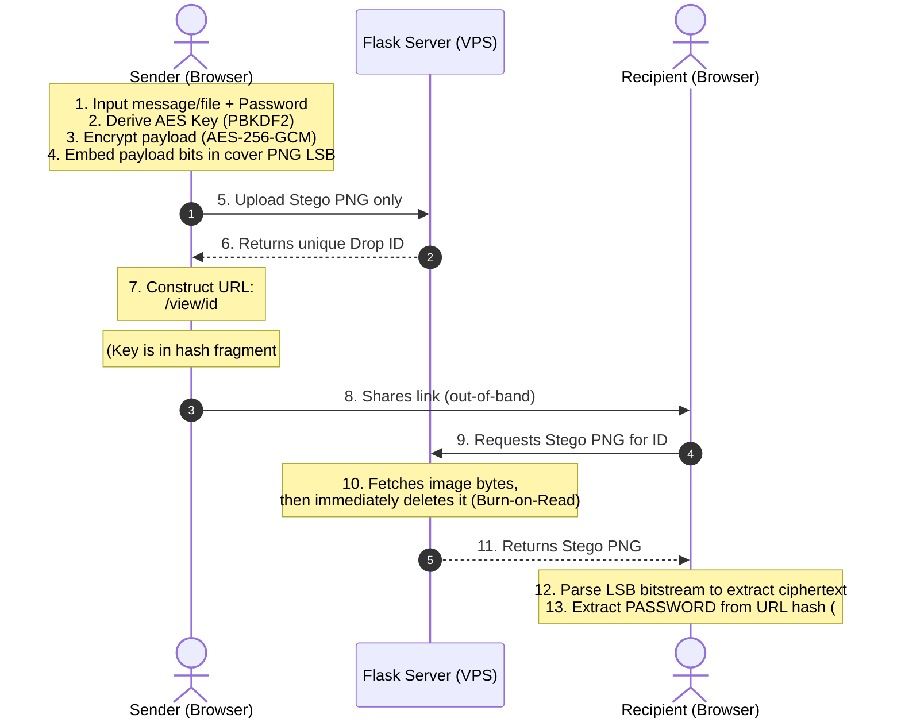

# StegSafe - Zero-Knowledge Steganography & Encrypted Link Drop 🗝️🖼️

A secure, zero-knowledge web-based steganography utility. It allows users to encrypt and embed confidential messages or files inside cover PNG images entirely client-side using the browser's native **Web Crypto API (AES-256-GCM)** and **Least Significant Bit (LSB)** canvas packing.

🔗 **Live Demo:** [https://stegsafe.vercel.app](https://stegsafe.vercel.app)

Users can save these images locally or drop them onto the portal to generate a self-destructing, one-time viewing link (burn-on-read).

---

## 🔒 The Zero-Knowledge Steganography Model

Traditional image sharing portals parse files on the backend. **StegSafe** performs all cryptography and pixel manipulation strictly inside the user's browser:



### Why this is secure:
1. **Zero Plaintext Transmission:** The server never sees the raw message, file content, or the encryption key.
2. **Client-Side Key Extraction:** The decryption key is passed in the URL hash fragment (`#`), which standard web browsers process locally and **never** send to the server in the HTTP request headers.
3. **Burn-on-Read:** The database row and files are permanently purged from the VPS SQLite backend immediately upon the first download request.

---

## 🛠️ Features
- **Client-Side Cryptography:** Securely encrypts payloads using **AES-256-GCM** via the browser's native `window.crypto.subtle` API.
- **Least Significant Bit (LSB) Steganography:** Packs bitstreams into the Red, Green, and Blue channels of cover image pixels using HTML5 canvas.
- **Binary-Safe Payload Packing:** Supports text messages as well as raw files (up to 200KB) through custom binary serialization.
- **Stealth Link Dropping:** Auto-purges file records from the SQLite storage portal after first retrieval or once the expiration timer completes.
- **Vibrant Glassmorphic UI:** Modern dark-cyberpunk dashboard for encoding and decoding stego-images.

---

## 🚀 Quick Start

### 1. Installation
Clone the repository and set up a virtual environment:
```bash
# Navigate to stegsafe folder
cd stegsafe

# Create and activate virtual environment
python -m venv .venv
source .venv/bin/activate  # On Windows: .venv\Scripts\activate

# Install requirements
pip install -r requirements.txt
```

### 2. Run the Local Backend Server
Start the Flask API host (runs on port `5005` by default):
```bash
python server.py
```

### 3. Run the Frontend locally
You can serve the `frontend/` directory using any static file server, for example:
```bash
cd frontend
python -m http.server 8000
```
Open your browser and navigate to `http://localhost:8000`.

---

## 🧪 Automated Tests
Execute the unit test suite verifying database writes, endpoint compliance, and expiration sweeps:
```bash
python -m unittest discover -s tests
```

---

## 📁 Repository Layout
- `frontend/`
  - `index.html` - Premium glassmorphic interface hosting Web Crypto GCM engines and canvas pixel packers.
  - `vercel.json` - Vercel rewrite configuration mapping API endpoints to the VPS host.
- `tests/`
  - `test_steg.py` - Flask backend unit tests.
- `server.py` - SQLite initializer, API server endpoints, and automatic background cleanup daemon.
- `requirements.txt` - Python module dependencies.
- `deploy_vps.ps1` - PowerShell VPS deployment template.
- `LICENSE` - MIT License.
